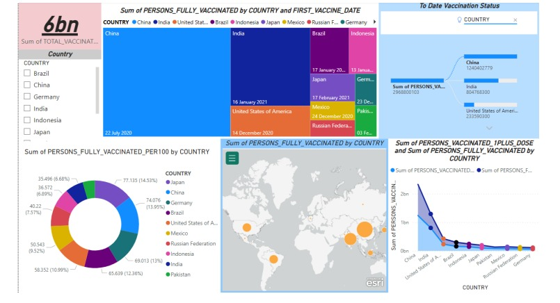

# Covid-Dashboard
## Data Visualization - Viva and Report
The given Covid Data gives the account of Covid Vaccinations administered in complete both
2 Doses and Only 1 dose administered.

## Dashborad

## Visualization:-
### 1st Visualization of Tree map gives the account of the Population vaccinated country wise
# accompanied by the corresponding vaccination start date.
### 2nd Visualization of Decomposition tree gives an account of branched vaccine zones along
# with the vaccine count of the countries.
### 3rd Visualization is Donought wherein the breakup of Vaccinations per 100 is shown country
# wise to give an insight into the rate of vaccination.
### 4th Visualization is a Map wherein the total vaccinations count for the countries is given.
### 5th Visualization is a line graph giving an insight into the Covid Vaccinations complete and
# those whose 1st dose is complete and thus indirectly indicating the number of 2nd doses still
to be undertaken.

## Insights:-
### 1. Japan accounted for 14.53% of Sum of PERSONS_FULLY_VACCINATED_PER100.
### 2. At 1240402779, China had the highest Sum of PERSONS_VACCINATED_1PLUS_DOSE
and was 1,971.61% higher than Germany, which had the lowest Sum of
PERSONS_VACCINATED_1PLUS_DOSE at 59876345.
### 3. Sum of PERSONS_VACCINATED_1PLUS_DOSE and total Sum of
PERSONS_FULLY_VACCINATED are positively correlated with each other.
### 4. China accounted for 41.78% of Sum of PERSONS_VACCINATED_1PLUS_DOSE.
### 5. Sum of PERSONS_VACCINATED_1PLUS_DOSE and Sum of
PERSONS_FULLY_VACCINATED diverged the most when the COUNTRY was India,
when Sum of PERSONS_VACCINATED_1PLUS_DOSE were 314928555 higher than Sum
of PERSONS_FULLY_VACCINATED.
